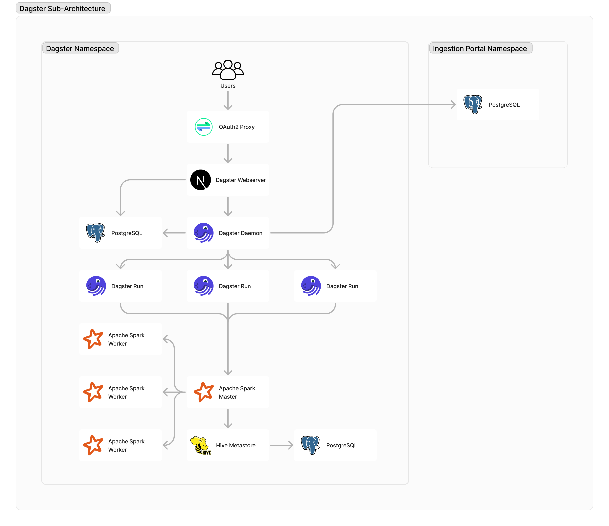

# Architecture

The data ingestion component of the platform is collectively referred to as "Dagster",
though the Dagster namespace architecture consists of several components other than the
former. Dagster itself serves as the backbone of the platform, orchestrating tasks and
data assets to materialize. It comprises several subcomponents:

- **Webserver**: The user interface allowing users to monitor runs and perform actions
  such as rerunning failed runs, enabling/disabling sensors and schedules, etc.
- **Daemon**: Responsible for running sensors and schedules, and scheduling runs.
- **Run**: Containers that run individual tasks. In the deployed environment, these also
  correspond to individual Kubernetes jobs.
- **Postgres**: The database where run metadata are stored.

As of writing, the Dagster OSS webserver does not have native authentication. Thus, we
deploy [OAuth2 Proxy](https://github.com/oauth2-proxy/oauth2-proxy) in front of the
webserver so that only authorized users through Entra ID can access it.

For running data processing, transformations, and data quality checks, the heavy lifting
is done in a distributed manner via [Spark](https://spark.apache.org/). This also gives
us access to the full feature set of Delta Lake. Spark also handles loading/saving of
Delta Tables, and these tables have to be catalogued somewhere so that they can be
accessed by external querying applications. [Hive Metastore](https://hive.apache.org/)
serves as the repository of table metadata and schemas, which is backed by its own
Postgres database.
