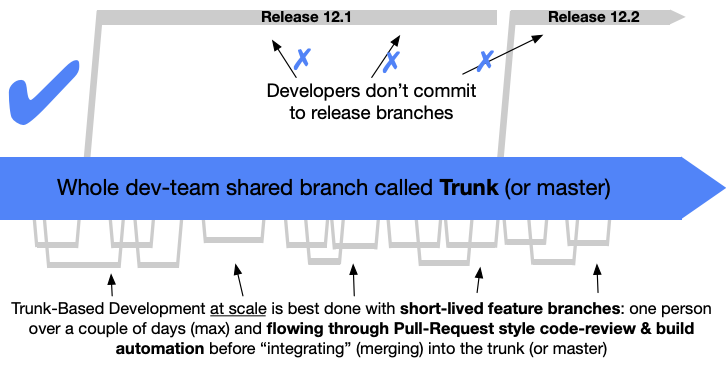
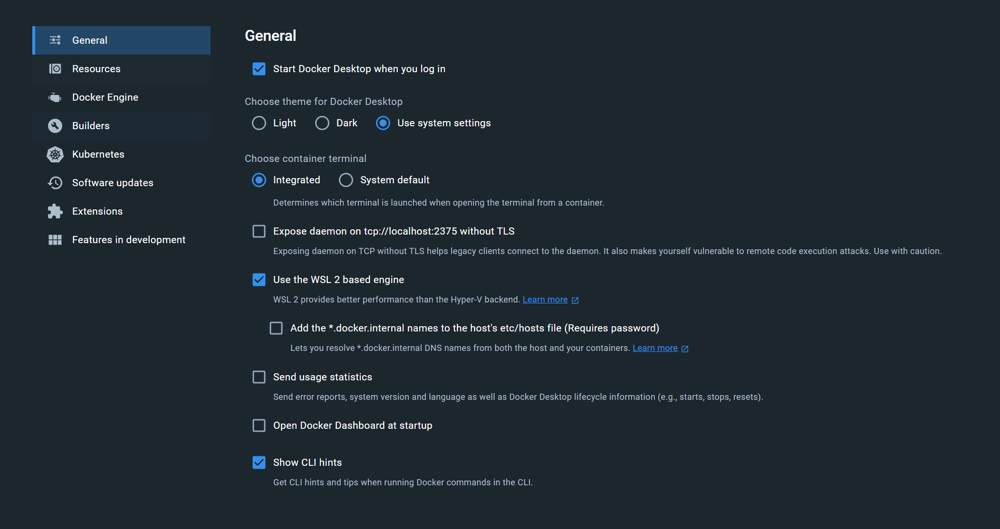
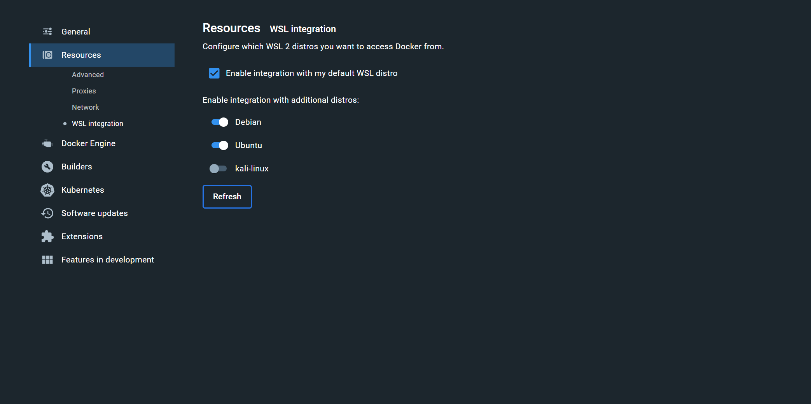
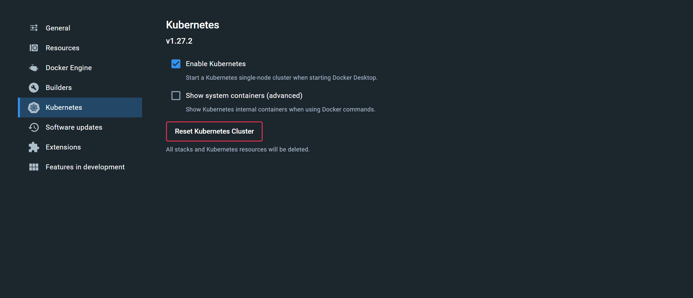

# Development Lifecycle

## Trunk Based Development



The Giga DataOps Platform project follows the concept of Trunk-Based Development,
wherein User Stories are worked on PRs. PRs then get merged to `main` once approved by
another developer.

The `main` branch serves as the most up-to-date version of the code base.

### Naming Conventions

#### Branch Names

Refer to [Conventional Commits](https://www.conventionalcommits.org/en/v1.0.0/).

#### PR Title

`[<Feature/Fix/Release/Hotfix>](<issue-id>) <Short desc>`

#### PR Template

[pull_request_template.md](../.github/pull_request_template.md)

### Development Workflow

- Branch off from `main` to ensure you get the latest code.
- Name your branch according to the Naming Conventions.
- Keep your commits self-contained and your PRs small and tailored to a specific feature
  as much as possible.
- Push your commits, open a PR and fill in the PR template.
- Request a review from 1 other developer.
- Once approved, rebase/squash your commits into `main`. Rule of thumb:
    - If the PR contains 1 or 2 commits, perform a **Rebase**.
    - If the PR contains several commits that build toward a larger feature, perform a
      **Squash**.
    - If the PR contains several commits that are relatively unrelated (e.g., an
      assortment of bug fixes), perform a **Rebase**.

## Local Development

### File Structure Walkthrough

- `azure/` - Contains all configuration for Azure DevOps pipelines.
- `dagster/` - Contains all custom Dagster code.
- `docs/` - This folder contains all Markdown files for creating Backstage TechDocs.
- `spark/` - Contains Docker build items for custom Hive Metastore image.
- `infra/` - Contains all Kubernetes & Helm configuration.
- `spark/` - Contains Docker build items for custom Spark image.
- `oauth2-proxy/` - Contains all Docker build items for custom OAuth2 Proxy image.

### Pre-requisites

#### Required

- [ ] [Docker](https://docs.docker.com/engine/)
- [ ] [Task](https://taskfile.dev/installation/#install-script)
- [ ] [asdf](https://asdf-vm.com/guide/getting-started.html)
- [ ] [Poetry](https://python-poetry.org/docs/#installation)
- [ ] [Python 3.11](https://www.python.org/downloads/)

#### As-needed

- [ ] [Kubernetes](https://kubernetes.io/docs/tasks/tools/)
    - If you are using Docker Desktop on Windows, you can use the bundled Kubernetes
      distribution.
- [ ] [Helm](https://helm.sh/docs/intro/install/)

#### Windows Subsystem for Linux (WSL)

_Skip this step if you are on Linux or Mac._

1. Check your `USERPROFILE` directory for a file named `.wslconfig`. You can navigate to
   this directory by opening the file explorer and entering `%USERPROFILE%` in the
   address bar. If the file does not exist, create it.
2. Ensure the following contents are in the file:
   ```
   [wsl2]
   memory=16GB
   swap=20GB
   ```
   This is working with the assumption of a workstation that has 4 cores, 32GB RAM, and
   1TB of storage. Adjust the values accordingly if you have different hardware
   specifications. Ideally, do not give WSL more than half of your available RAM.
3. [Install WSL](https://learn.microsoft.com/en-us/windows/wsl/install). You may be
   prompted to restart your device.
4. In a separate Powershell/Command Prompt (CMD) terminal, run:
    ```shell
    wsl --set-default-version 2
    ```
5. Open the Microsoft Store, search for and install Ubuntu.
6. In the Powershell/CMD terminal, run:
    ```shell
    wsl --set-default Ubuntu
    ```
7. In the start menu, Ubuntu should show up in the recently added programs. Open it.
8. You will be prompted for a new username and password. Enter any credentials and make
   sure to remember them. You may be prompted to restart again.
9. If you are not prompted to restart, close Ubuntu and open it again. You should now
   have a working WSL installation.

> [!IMPORTANT]
> From this point on, all commands should be run inside the Ubuntu terminal, unless
> otherwise specified.

#### Docker

1. Install [Docker Desktop](https://www.docker.com/products/docker-desktop/). You may be
   prompted to restart your device.
2. Open the Docker Desktop app and go to settings.
3. Ensure you have the following settings:
   
   
   
   > [!NOTE]
   > WSL integration settings are only applicable if you are on Windows.
4. Wait for the Kubernetes installation to complete.
5. To test if everything is setup correctly, run this inside an Ubuntu terminal:
   ```shell
   docker image ls -a
   kubectl get all
   ```
   If you get no errors, you're good to go!

#### Kubernetes

Kubernetes is installed as part of the Docker Desktop installation. You can optionally
install the `kubectx` and `kubens` plugins to make it easier to switch between
contexts/namespaces.

Install [Krew](https://krew.sigs.k8s.io/docs/user-guide/setup/install/):

1. Run the following:
   ```shell
   (
    set -x; cd "$(mktemp -d)" &&
    OS="$(uname | tr '[:upper:]' '[:lower:]')" &&
    ARCH="$(uname -m | sed -e 's/x86_64/amd64/' -e 's/\(arm\)\(64\)\?.*/\1\2/' -e 's/aarch64$/arm64/')" &&
    KREW="krew-${OS}_${ARCH}" &&
    curl -fsSLO "https://github.com/kubernetes-sigs/krew/releases/latest/download/${KREW}.tar.gz" &&
    tar zxvf "${KREW}.tar.gz" &&
    ./"${KREW}" install krew
   )
   ```
2. Add the Krew path to your system `PATH` by appending to your `.bashrc`/`.zshrc` (i.e.
   run the following):
   ```shell
   echo 'export PATH="${KREW_ROOT:-$HOME/.krew}/bin:$PATH"' >> ~/.bashrc
   ```
3. Load your new shell config:
    ```shell
    # bash
    source ~/.bashrc
   
    # zsh
    source ~/.zshrc
    ```
4. Download the Krew plugin list
    ```shell
    kubectl krew update
    ```
5. Install `kubectx` and `kubens`
    ```shell
    kubectl krew install ctx
    kubectl krew install ns
    ```
6. Test if installation is ok:
    ```shell
    kubectl ctx
    kubectl ns
    ```

#### asdf

1. Install [asdf](https://asdf-vm.com/guide/getting-started.html).
2. Test installation:
    ```shell
    asdf
    ```

#### Python

1. Install Python build dependencies:
    - **MacOS**
      ```shell
      brew install openssl readline sqlite3 xz zlib tcl-tk
      ```
    - **Linux/WSL**
      ```shell
      sudo apt-get update
      sudo apt-get install -y build-essential libssl-dev zlib1g-dev libbz2-dev libreadline-dev libsqlite3-dev curl libncursesw5-dev xz-utils tk-dev libxml2-dev libxmlsec1-dev libffi-dev liblzma-dev
      ```
2. Install Python
    ```shell
    asdf plugin add python
    asdf install python 3.11.7
    ```

#### Poetry

1. Install Poetry
    ```shell
    asdf add plugin poetry
    asdf install poetry 1.7.1
    ```
2. Add Poetry path to your shell config:
    ```shell
    echo 'export PATH="$HOME/.local/bin:$PATH"' >> ~/.bashrc
    ```
3. Reload shell config:
    ```shell
    source ~/.bashrc
    ```
4. Test installation:
    ```shell
    poetry --version
    ```
5. Set recommended settings:
   ```shell
   poetry config virtualenvs.in-project true
   ```

#### Task

1. Install Task:
    ```shell
    sh -c "$(curl --location https://taskfile.dev/install.sh)" -- -d -b ~/.local/bin
    ```
2. Test installation:
    ```shell
    task --version
    ```

### Cloning and Installation

1. `git clone` the repository to your workstation.
2. Run initial setup:
    ```shell
    task setup
    ```

### Environment Setup

**Dagster**, **Spark**, and **Hive** have their own respective `.env` files. The
contents of these files can be provided upon request. There are also `.env.example`
files which you can use as reference. Copy the contents of this file into a new file
named `.env` in the same directory, then supply your own values.

Ensure that the Pre-requisites have already been set up and all the necessary
command-line executables are in your `PATH`.

### Running the Application

```shell
# spin up Docker containers
task

# Follow Docker logs
task logs

# List all tasks (inspect Taskfile.yml to see the actual commands being run)
task -l
```

#### Housekeeping

At the end of your development tasks, stop the containers to free resources:

```shell
task stop
```

### Adding dependencies

Example: Adding `dagster-azure`

```shell
# cd to relevant folder
cd dagster

# Add the dependency using poetry
poetry add dagster-azure

# Re-run task
task
```
